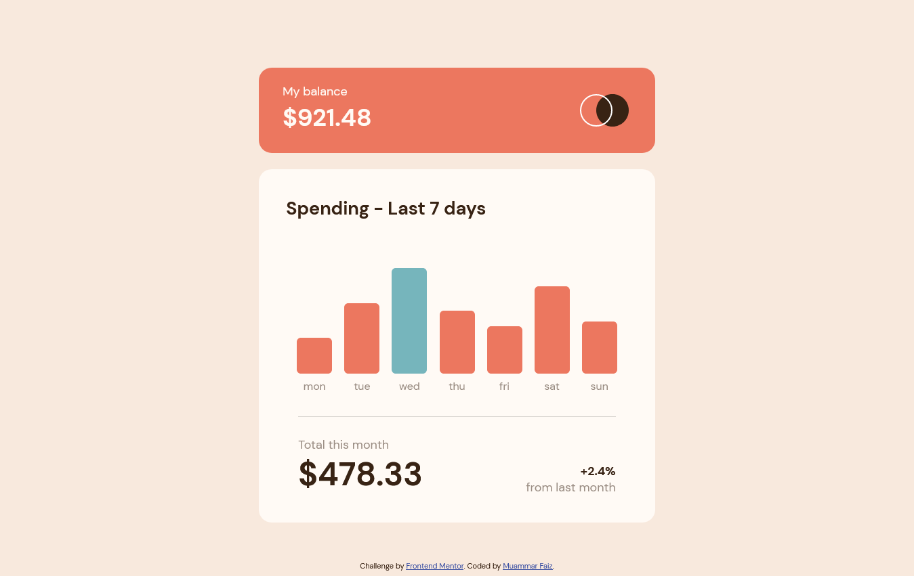

# Frontend Mentor - Expenses chart component solution

This is a solution to the [Expenses chart component challenge on Frontend Mentor](https://www.frontendmentor.io/challenges/expenses-chart-component-e7yJBUdjwt). Frontend Mentor challenges help you improve your coding skills by building realistic projects. 

## Table of contents

- [Overview](#overview)
  - [The challenge](#the-challenge)
  - [Screenshot](#screenshot)
  - [Links](#links)
- [My process](#my-process)
  - [Built with](#built-with)
  - [What I learned](#what-i-learned)
  - [Continued development](#continued-development)
  - [Useful resources](#useful-resources)
- [Author](#author)
- [Acknowledgments](#acknowledgments)

## Overview

### The challenge

Users should be able to:

- View the bar chart and hover over the individual bars to see the correct amounts for each day (done)
- See the current day’s bar highlighted in a different colour to the other bars (done)
- View the optimal layout for the content depending on their device’s screen size (done)
- See hover states for all interactive elements on the page (done)
- **Bonus**: Use the JSON data file provided to dynamically size the bars on the chart (done)

### Screenshot



Add a screenshot of your solution. The easiest way to do this is to use Firefox to view your project, right-click the page and select "Take a Screenshot". You can choose either a full-height screenshot or a cropped one based on how long the page is. If it's very long, it might be best to crop it.

Alternatively, you can use a tool like [FireShot](https://getfireshot.com/) to take the screenshot. FireShot has a free option, so you don't need to purchase it. 

Then crop/optimize/edit your image however you like, add it to your project, and update the file path in the image above.

### Links

- Solution URL: [github repository](https://github.com/muammarFaiz/frontendmentor-expensesChartComp)
- Live Site URL: [github page](https://muammarfaiz.github.io/frontendmentor-expensesChartComp/)

## My process

### Built with

- HTML
- CSS
- Flexbox
- CSS Grid
- desktop-first workflow
- [React](https://reactjs.org/) - JS library

### What I learned

- using position relative and absolute combo to make the make the child stay on the bottom side of its parent
```css
.container {
  position: relative;
}
.child {
  position: absolute;
  bottom: 0;
}
```
- learning how to use ReactJS class component without JSX
```js
const reactElement = React.createElement('div', {className: 'abc'}, 'my div')
```
- using fetch to import json file
- rgba, a for opacity

### Continued development

wanna learn about SASS or maybe other CSS Preprocessor, also practice and practice

### Useful resources

- [StackOverflow](https://stackoverflow.com/) - for obvious reasons
- [MDN Mozilla](https://developer.mozilla.org/en-US/) - for obvious reasons
- [Kevin Powell Youtube channel](https://www.example.com) - mr Kevin Powell the king of CSS


## Author

- LinkedIn - [Muammar Faiz](https://www.linkedin.com/in/muammar-faiz-99758a227/)
- Frontend Mentor - [@muammarFaiz](https://www.frontendmentor.io/profile/muammarFaiz)

## Acknowledgments

I would like to say thank you very much to myself and God
